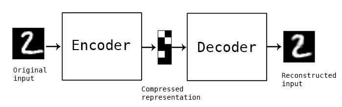
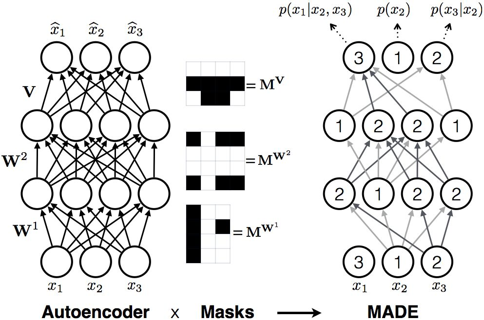
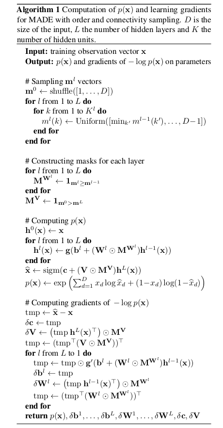
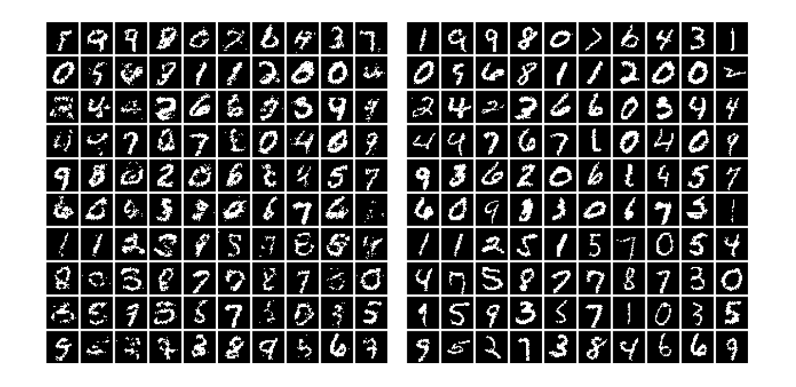



> *Originally published on [NEUROVERSE](https://neuroverse0.wordpress.com/2020/07/14/made-masked-autoencoder-for-distribution-estimation/).*

These days, everyone is talking about BigGAN, StyleGAN and their remarkable and diverse results on massive image datasets. Yeah, the results are pretty cool! As a result, there has been a tremendous decline in the research of other generative models like Autoregressive models and Variational Autoencoders. So today, we are going to see one of these unnoticed generative models: MADE.

Generative models are a big part of deep unsupervised learning. There are two types of generative models: 1) Explicit models (in which we can explicitly define the form of the data distribution) and 2) Implicit models (in which we can't explicitly define the density of data). MADE is an example of a tractable density estimation model in explicit models. The aim of this model is to estimate a distribution from a set of examples.

The model masks the autoencoder's parameters to impose autoregressive constraints: each input can only be reconstructed from previous inputs in a given ordering. Autoencoder outputs can be interpreted as a set of conditional probabilities, and their product, the full joint probability.

> "Autoregression is a time series model that uses observations from previous time steps as input to a regression equation to predict the value at the next time-step."

---

## Autoencoders

Autoencoder is an unsupervised neural network that learns how to compress and encode data efficiently then learns how to reconstruct the data back from the reduced encoded representation to a representation that is as close to the original input as possible.

The process of transforming input \\(x\\) to latent representation \\(z\\) is called the encoder and from latent variable \\(z\\) to reconstructed version of the input \\(\hat{x}\\) is referenced as the decoder.

Lower dimensional latent representation has lesser noise than input and contains essential information of the input image. So the information can be used to generate an image that is different from the input image but within the input data distribution. By computing dimensionally reduced latent representation \\(z\\), we are ensuring that the model is not reconstructing the same input image.

Let's suppose we are given a training set of examples \\(\{x^{(1)}, x^{(2)}, \ldots, x^{(n)}\}\\). Here \\(x \in \{0,1\}^D\\) and \\(y \in \{0,1\}^D\\), because we are concentrating on binary inputs. Our motivation is to learn a latent representation, by which we can obtain the distribution of these training examples using deep neural networks.

Suppose the model contains one hidden layer and tries to learn \\(h(x)\\) from its input \\(x\\) such that from it, we can generate reconstruction \\(\hat{x}\\) which is as close as possible to \\(x\\). Such that,

$$h(x) = g(Wx + b)$$
$$\hat{x} = \text{sigm}(Vh + c)$$

Where \\(W\\) and \\(V\\) are matrices, \\(b\\) and \\(c\\) are vectors, \\(g\\) is a non-linear activation function and sigm is a sigmoid function.

Cross-entropy loss of above autoencoder is,

$$l(x) = -\sum_{d=1}^{D} \left[ x_d \log \hat{x}_d + (1 - x_d) \log(1 - \hat{x}_d) \right]$$

We can treat \\(\hat{x}_d\\) as the model's probability that \\(x_d\\) is 1, so \\(l(x)\\) can be understood as a negative log-likelihood function. Now the autoencoder can be trained using a gradient descent optimization algorithm to get optimal parameters \\((W, V, b, c)\\) and to estimate data distribution. But the loss function isn't actually a proper log-likelihood function. The implied data distribution \\(q(x) = \prod_d \hat{x}_d^{x_d} (1 - \hat{x}_d)^{(1-x_d)}\\) isn't normalized (\\(\sum_x q(x) \neq 1\\)). So **outputs of the autoencoder can not be used to estimate density**.

---

## Distribution Estimation as Autoregression

Now we want to impose some property on autoencoders, such that its output can be used to obtain valid probabilities. By using autoregressive property, we can transform the traditional autoencoder approach into a fully probabilistic model.

We can write joint probability as a product of their conditional probabilities by chain rule,

$$p(x) = \prod_{d=1}^{D} p(x_d \mid x_{<d})$$

Define, \\(p(x_d = 1 \mid x_{<d}) = \hat{x}_d\\) and \\(p(x_d = 0 \mid x_{<d}) = (1 - \hat{x}_d)\\). So now the loss function in the previous part becomes a valid negative log-likelihood function.

$$\mathcal{L}(x) = -\sum_{d=1}^{D} \left[ x_d \log \hat{x}_d + (1 - x_d) \log(1 - \hat{x}_d) \right]$$

Here each output \\(\hat{x}_d\\) must be a function taking as input \\(x_{<d}\\) only and giving output the probability of observing value \\(x_d\\) at the \\(d\\)th dimension. Computing above NLL is equivalent to sequentially predicting each dimension of input \\(x\\), so we are referring to this property as an autoregressive property.

---

## Masked Autoencoders

Since output \\(\hat{x}_d\\) must depend on the preceding inputs \\(x_{<d}\\), it means that there must be no computational path between output unit \\(\hat{x}_d\\) and any of the input units \\(x_i\\) where \\(i \geq d\\).

So we want to discard the connection between these units by element-wise multiplying each weight matrix by a binary mask matrix, whose entries that are set to 0 correspond to the connections we wish to remove.

$$h(x) = g((M^W \odot W)x + b)$$
$$\hat{x} = \text{sigm}((M^V \odot V)h + c)$$

Where \\(M^W\\) and \\(M^V\\) are mask matrices of the same dimension as \\(W\\) and \\(V\\) respectively, now we want to design these masks in a way such that they satisfy the autoregressive property.

To impose the autoregressive property, we first assign each unit in the hidden layer an integer \\(m\\) between 1 and \\(D-1\\) inclusively. The \\(k\\)th hidden unit's number \\(m(k)\\) represents the maximum number of input units to which it can be connected. Here values 0 and \\(D\\) are excluded because \\(m(k) = 0\\) means it is a constant hidden unit, and \\(m(k) = D\\) means it can be connected to maximum \\(D\\) input units, so both the conditions violate the autoregressive property.

There are few things to notice:

- Input 3 is not connected to any hidden unit because no output node shouldn't depend on it.
- Output 1 is not connected to any previous hidden unit, and it is estimated from only the bias node.
- If you trace back from output to input units, you can clearly see that autoregressive property is maintained.

Let's consider Multi-layer perceptron with \\(L\\) hidden layers. For every layer \\(l \in \{1, \ldots, L\}\\), \\(m^l(k)\\) stands for the maximum number of connected inputs of the \\(k\\)th unit in the \\(l\\)th layer.

The constraints on the maximum number of inputs to each hidden unit are encoded in the matrix masking the connections between the input and hidden units:

$$M^W_{k,d} = \mathbf{1}_{m(k) \geq d}$$

And these constraints are encoded on output mask matrix:

$$M^V_{d',k} = \mathbf{1}_{d' > m(k)}$$

Note that \\(\geq\\) becomes \\(>\\) in output mask matrix. This thing is vital as we need to shift the connections by one. The first output \\(x_2\\) must not be connected to any nodes as it is not conditioned by any inputs.

We set \\(m^l(k)\\) for every layer \\(l \in \{1, \ldots, L\}\\) by sampling from a discrete uniform distribution defined on integers from \\(\min_{k'} m^{l-1}(k')\\) to \\(D-1\\) whereas \\(m^0\\) is obtained by randomly permuting the ordered vector \\([1, 2, \ldots, D]\\).

Deep NADE models require \\(D\\) feed-forward passes through the network to evaluate the probability \\(p(x)\\) of a \\(D\\)-dimensional test vector, but **MADE only requires one pass through the autoencoder**.

---

## Inference

Basically the paper was written to estimate the distribution of the input data. The inference wasn't explicitly mentioned in the paper. It turns out it's quite easy but a bit slow. The main idea (for binary data):

1. Randomly generate vector \\(x\\), set \\(i = 1\\)
2. Feed \\(x\\) into autoencoder and generate outputs \\(\hat{x}\\) for the network, set \\(p = \hat{x}_i\\)
3. Sample from a Bernoulli distribution with parameter \\(p\\), set input \\(x_i = \text{Bernoulli}(p)\\)
4. Increment \\(i\\) and repeat steps 2-4 until \\(i > D\\)

The inference in MADE is very slow, it isn't an issue at training because we know all \\(x_{<d}\\) to predict the probability at \\(d\\)th dimension. But at inference, we have to predict them one by one, without any parallelization.

Though MADE can generate recognizable 28×28×1 images on MNIST dataset. But it is very computationally expensive to generate high dimensional images from a large dataset.

---

## Conclusion

MADE is a very straightforward yet efficient approach to estimate probability distribution from a single pass through an autoencoder. MADE is not able to generate pretty good images as compared to state-of-the-art techniques (GANs), though it has built a very strong base for tractable density estimation models such as PixelRNN/PixelCNN and Wavenet. Nowadays Autoregressive models are not used in the generation of the image and It is one of the less explored areas in generative models. But still, its simplicity makes room for the advancement of research in this field.

---

## References

1. Germain, Gregor & Larochelle (2015). *MADE: Masked Autoencoder for Distribution Estimation*. [arXiv:1502.03509](https://arxiv.org/abs/1502.03509)
2. Karpathy, A. (2018). *pytorch-made*. [github.com/karpathy/pytorch-made](https://github.com/karpathy/pytorch-made)
