

> *Originally published on [NEUROVERSE](https://neuroverse0.wordpress.com/2020/08/11/pixelrnn-gated-pixelcnn-and-pixelcnn/).*

Beyond image generation, deep unsupervised learning encompasses crucial tasks including image compression and reconstruction methods such as image inpainting and deblurring. Since GANs cannot explicitly define input data distribution and variational autoencoders face intractability challenges, tractable and scalable models estimating high-dimensional structured image densities — specifically autoregressive models — become essential. A foundational example, MADE, was discussed previously. This post explores Pixel Recurrent Neural Networks and several PixelCNN variations.

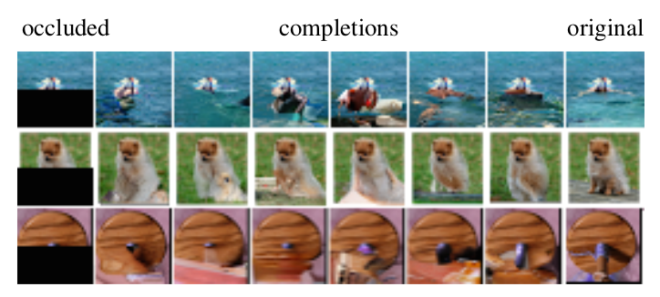

A superior approach to tractably modeling joint pixel distribution involves converting it into conditional probability products through an autoregressive approach. Sequential pixel generation occurs given previously generated pixels. Maintaining nonlinear long-term dependencies between image pixels and estimating complex distributions requires highly expressive sequence models like Recurrent Neural Networks, which excel at difficult sequence problems through compact, shared parametrization of conditional distributions.

---

## 1. PixelRNN

The network scans images row-by-row and pixel-by-pixel within each row. For each pixel, it predicts the conditional distribution over possible pixel values given the scanned context.

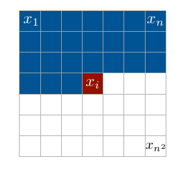

The objective involves assigning probability \\(p(x)\\) to an \\(n \times n\\) dimension image \\(x\\). The image converts to a one-dimensional pixel sequence. Joint probability becomes a conditional probability product via chain rule:

$$p(x) = \prod_{i=1}^{n^2} p(x_i \mid x_1, \ldots, x_{i-1})$$

Here, \\(p(x_i \mid x_1, \ldots, x_{i-1})\\) represents the \\(i\\)th pixel probability given all previously generated pixels from \\(x_1\\) to \\(x_{i-1}\\). Generation proceeds row-by-row and pixel-by-pixel.

Each pixel \\(x_i\\) contains three values — Red, Green, and Blue color channels. Thus, each color pixel conditions on other colors and previously generated pixels. Therefore:

$$p(x_i \mid x_{<i}) = p(x_i^R \mid x_{<i}) \cdot p(x_i^G \mid x_{<i}, x_i^R) \cdot p(x_i^B \mid x_{<i}, x_i^R, x_i^G)$$

When predicting the \\(i\\)th Green channel pixel, conditioning occurs on all previously generated pixels \\((x_1, \ldots, x_{i-1})\\) across all channels, plus the \\(i\\)th Red channel pixel. Similarly, Blue channel \\(i\\)th pixel additionally conditions on Red and Green \\(i\\)th pixels.

A notable aspect: training and evaluation of pixel value distributions occur in parallel, while image generation remains sequential. Since all previous pixels are known during training's \\(i\\)th pixel prediction, computation parallelizes. Inference lacks this advantage.

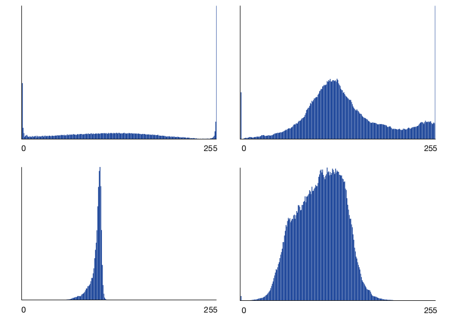

Pixel value distributions are modeled discretely, with every conditional distribution being a multinomial via a softmax layer added as the final model layer. Each pixel of each channel \\(x_{i,*}\\) receives a softmax distribution valued from 0 to 255. If a particular pixel's predicted probability distribution peaks at value 110, that value becomes the pixel assignment. Discrete probability distributions prove easier to learn than continuous ones, yielding superior performance.

### 1.1 Building Blocks

Two major building blocks assist the architecture by applying dependencies and accelerating training:

#### 1.1.1 Masked Convolution

Each input position's \\(h\\) features at every network layer split into three RGB channel parts. When predicting R channel for current pixel \\(x_i\\), only generated pixels left and above \\(x_i\\) serve as context. When predicting G channel, the R channel value becomes additional context alongside previously generated pixels. Network connections restrict to these dependencies via masking on input-to-state convolutions and purely convolutional layers.

Two mask types — A and B — are implemented. **Mask A** applies solely to the first PixelRNN convolutional layer, restricting connections to neighboring pixels and already-predicted current pixel colors. **Mask B** applies to subsequent input-to-state convolutional transitions, relaxing Mask A restrictions by allowing color-to-self connections. Implementation involves zeroing corresponding input-to-state convolution weights after each update.

#### 1.1.2 Residual Connections

PixelRNNs train with up to twelve depth layers. Residual connections increase convergence speed and propagate signals directly through the network, deploying from one LSTM layer to the next.

### 1.2 Model Architecture

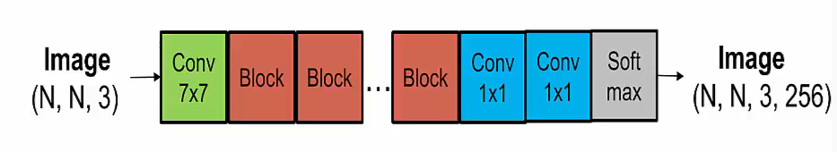

The PixelRNN paper presents four architecture types:

1. Row LSTM
2. Diagonal BiLSTM
3. PixelCNN
4. Multi-scale PixelRNN

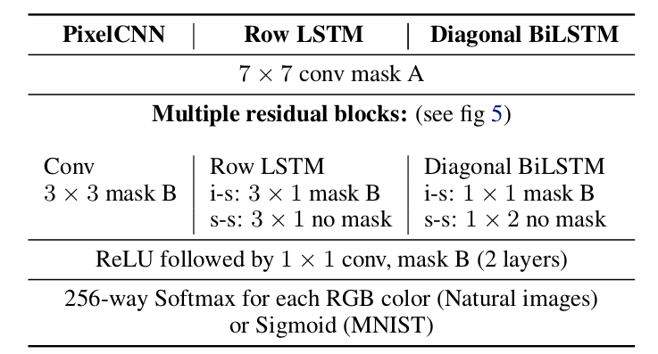

#### 1.2.1 Row LSTM

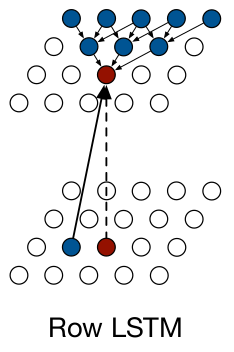

Row LSTM is unidirectional, processing images row-by-row from top to bottom, computing entire row features simultaneously via one-dimensional convolution. LSTM layers contain input-to-state components and recurrent state-to-state components together determining four gates inside the LSTM core.

Enhancing Row LSTM parallelization, input-to-state computation occurs across the entire two-dimensional input map using one-dimensional \\(3 \times 1\\) convolution with mask-B. This produces a \\(4h \times n \times n\\) tensor representing four gate vectors per input position, where \\(h\\) equals output feature map numbers.

Computing \\(i\\)th step state-to-state LSTM components uses one-dimensional \\(3 \times 1\\) convolution on \\(h_{i-1}\\) (previous hidden state) of size \\(h \times n \times 1\\). New hidden and cell states \\(h_i\\) and \\(c_i\\) are obtained as:

$$[o_i, f_i, i_i, g_i] = \sigma(K^{ss} \circledast h_{i-1} + K^{is} \circledast x_i)$$
$$c_i = f_i \odot c_{i-1} + i_i \odot g_i$$
$$h_i = o_i \odot \tanh(c_i)$$

Where:
- \\(x_i\\) = row \\(i\\) input map of size \\(h \times n \times 1\\)
- \\(\circledast\\) = convolution operation
- \\(\odot\\) = element-wise multiplication
- \\(K^{ss}\\) = state-to-state component kernel weights
- \\(K^{is}\\) = input-to-state component kernel weights
- \\(\sigma\\) = activation function (sigmoid for input, forget, output gates; tanh for content gate)

Each step computes new state for an entire input row simultaneously, accelerating training. However, Row LSTM has triangular receptive field, preventing full available context capture.

#### 1.2.2 Diagonal BiLSTM

Diagonal BiLSTM both parallelizes computation and captures entire available context. Two directional layers scan images diagonally from corner-to-corner. Each computational step computes LSTM state along a diagonal simultaneously.

Input-to-state components simply employ \\(1 \times 1\\) convolution \\(K^{is}\\) contributing to LSTM core gates, generating \\(4h \times n \times n\\) tensors.

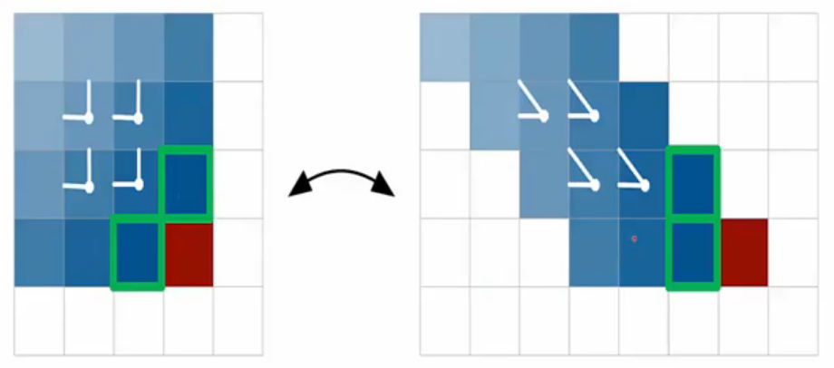

For Left-to-Right direction, predicting pixel \\(x_{i,j}\\) depends on \\(x_{i-1,j}\\) and \\(x_{i,j-1}\\). Diagonal convolution proves computationally difficult, so input image skewing occurs. Row offsetting by one position rightward relative to previous rows yields \\(n \times (2n-1)\\) maps.

Then \\(2 \times 1\\) state-to-state convolution with \\(K^{ss}\\) applies. Output feature maps skew back into \\(n \times n\\) forms by removing offset positions.

For Right-to-Left direction, predicting \\(x_{i,j}\\) depends on \\(x_{i+1,j}\\) and \\(x_{i,j-1}\\). However, \\(x_{i+1,j}\\) hasn't been predicted yet. Resolution involves shifting the map down by one row, then skewing. Row offsetting occurs leftward relative to previous rows.

Left-to-Right and Right-to-Left output maps combine for the final state-to-state component. Diagonal BiLSTM uses all available context with global receptive field, improving performance at training time cost.

#### 1.2.3 PixelCNN

Row and Bidirectional LSTM feature unbounded dependency ranges within receptive fields, making sequential computation expensive. Standard convolutional layers capture bounded receptive fields and compute features for all pixel positions simultaneously.

Parallel computation exploits only training time. Inference lacks all future pixel knowledge, requiring sequential computation. PixelCNN trains faster than Row LSTM and Diagonal BiLSTM, but small receptive field limits performance.

#### 1.2.4 Multi-Scale PixelRNN

Multi-Scale PixelRNN comprises unconditional PixelRNN and one or more conditional PixelRNNs.

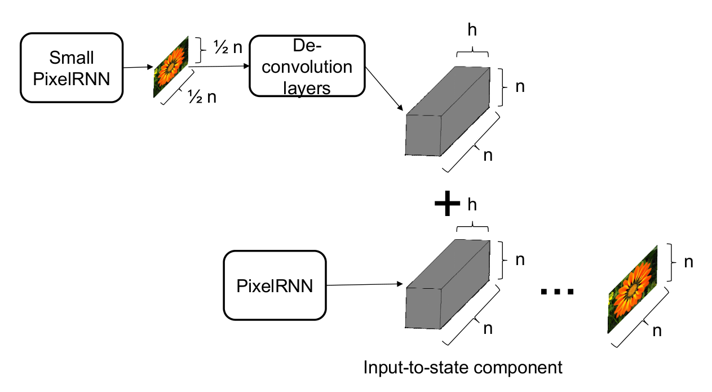

The unconditional network first generates smaller \\(s \times s\\) images subsampled from originals. Deconvolutional layer upsampling produces \\(h \times n \times n\\) size where \\(h\\) represents output map feature numbers.

In biasing, each conditional PixelRNN layer maps \\(h \times n \times n\\) conditioning maps into \\(4h \times n \times n\\) maps via \\(1 \times 1\\) unmasked convolution, adding to corresponding input-to-state maps. The \\(n \times n\\) image generates subsequently as usual.

---

## 2. Gated PixelCNN

PixelRNNs generally outperform, but PixelCNNs train considerably faster since convolutions naturally parallelize better; given vast image dataset pixels, this advantage proves crucial.

PixelCNN's major drawback — addressed by Gated PixelCNN — involves receptive field blind spots preventing prediction usage. Problems emerge when predicting left-side image pixels, since rightward content doesn't contribute.

This work removes blind spots by combining two convolutional network stacks: one conditioning on current row values thus far (**horizontal stack**) and one conditioning on all above rows (**vertical stack**).

The vertical stack features no masking, allowing receptive field (\\(1 \times 3\\) kernel) rectangular growth without blind spots. The horizontal stack has \\(1 \times 1\\) receptive field; outputs combine post-layer from both stacks. Every horizontal stack layer accepts previous layer output plus vertical stack output.

PixelRNN superiority partly stems from unbounded receptive field compared to bounded PixelCNN receptive fields, plus multiplicative units (LSTM gates) assisting complex interaction estimation.

Addressing this, ReLU activation functions between original PixelCNN masked convolutions were replaced with **gated activation units**:

$$y = \tanh(W_{f,k} \ast x) \odot \sigma(W_{g,k} \ast x)$$

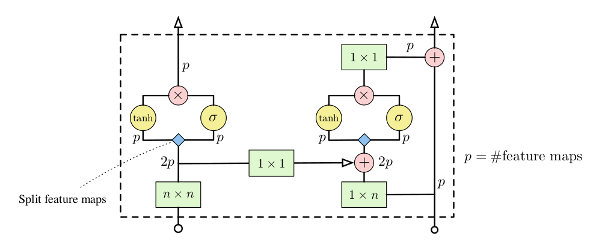

Results demonstrate Gated PixelCNN outperforming PixelCNN with performance comparable to PixelRNN while requiring less than half training time.

---

## 3. PixelCNN++

Implementation modifications simplify structure and improve performance through the following modifications:

### 3.1 Discretized Logistic Mixture Likelihood

Standard PixelCNN employs softmax layers estimating sub-pixel conditional distributions, proving memory-costly and creating sparse gradients early during training.

Countering this assumes latent color intensity \\(\nu\\) with continuous distribution, rounded to nearest 8-bit representation producing observed sub-pixel value \\(x\\). For all sub-pixel values \\(x\\) except edge cases 0 and 255:

$$P(x \mid \mu, s) = \sigma\left(\frac{x + 0.5 - \mu}{s}\right) - \sigma\left(\frac{x - 0.5 - \mu}{s}\right)$$

where \\(\sigma()\\) represents logistic sigmoid function. Edge case 0 replaces \\(x - 0.5\\) with \\(-\infty\\), while 255 replaces \\(x + 0.5\\) with \\(+\infty\\).

Network output utilizing smooth, memory-efficient predictive distribution achieves much lower dimensionality, yielding denser loss gradients respecting parameters.

### 3.2 Conditioning on Whole Pixels

Original PixelCNN factorizes generative models over three sub-pixels (RGB), complicating the model. Color channel dependencies likely remain relatively simple, requiring shallow networks for modeling. Instead, conditioning occurs on whole pixels up and leftward, outputting joint predictive distributions across all three predicted pixel channels.

For pixel \\((r_{i,j}, g_{i,j}, b_{i,j})\\) at location \\((i,j)\\), the distribution conditional on context \\(C_{i,j}\\) (comprising mixture indicator and previous pixels) uses scalar coefficients \\(\alpha, \beta, \gamma\\) depending on mixture components and previous pixels.

### 3.3 Downsampling

Small receptive fields prevent PixelCNN long-range dependency computation. Authors suggested downsampling via stride-2 convolutions, reducing computational cost while losing information, compensated by introducing additional shortcut connections.

### 3.4 Adding Shortcut Connections

The model comprises six blocks and five ResNet layers. Blocks 2 and 3 downsample while blocks 5 and 6 upsample. Information loss occurs throughout upsampling/downsampling processes.

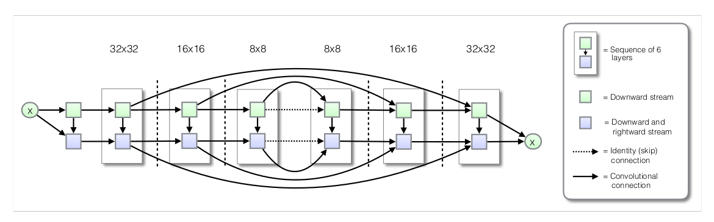

Long-range skip-connections employ such that each \\(k\\)-th layer provides direct input to the \\((K-k)\\)-th layer, where \\(K\\) equals total network layers.

### 3.5 Regularization Using Dropout

PixelCNN model power suffices for training data overfitting without regularization. Standard binary dropout applies to residual paths following first convolution.

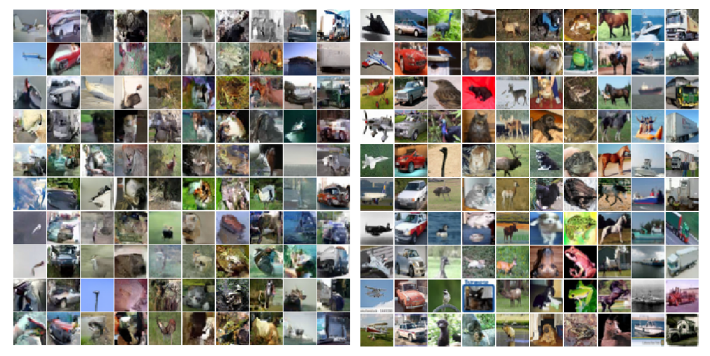

PixelCNN++ outperforms both PixelRNN and PixelCNN substantially. Performance drops when any modification isn't used; models learn slowly or sometimes fail learning completely.

---

## 4. Conclusion

PixelRNN papers significantly improve and build upon deep recurrent neural networks as natural image generative models. Convolutional LSTM introduction in generating image architecture opens new generative model paths. Gated PixelCNN tackles PixelCNN drawbacks, proving receptive field importance for image generation. PixelCNN++ contains numerous PixelCNN modifications improving performance, even outperforming PixelRNNs. Autoregressive models prove computationally expensive for large image dataset generation, though training remains very stable, generating excellent results in image compression, inpainting, and deblurring tasks.

---

## 5. References

1. Van den Oord, A., Kalchbrenner, N., & Kavukcuoglu, K. (2016). *Pixel Recurrent Neural Networks*. [arXiv:1601.06759](https://arxiv.org/pdf/1601.06759.pdf)
2. Van den Oord, A., et al. (2016). *Conditional Image Generation with PixelCNN Decoders*. [arXiv:1606.05328](https://arxiv.org/pdf/1606.05328.pdf)
3. Salimans, T., Karpathy, A., Chen, X., & Kingma, D. P. (2017). *PixelCNN++: Improving the PixelCNN with Discretized Logistic Mixture Likelihood and Other Modifications*. [arXiv:1701.05517](https://arxiv.org/pdf/1701.05517.pdf)
4. Lebanoff, L. (2017). *Pixel Recurrent Neural Networks* (Presentation). [UCF CRCV](https://www.crcv.ucf.edu/wp-content/uploads/2019/03/CAP6412_Spring2018_Pixel-Recurrent-Neural-Networks.pdf)
